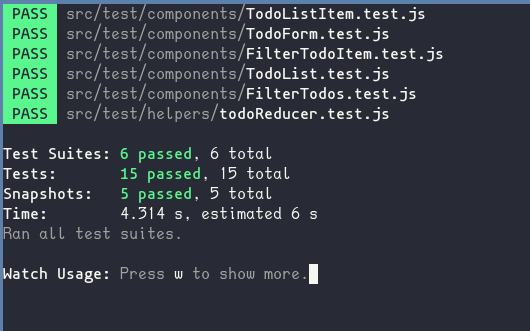

# [TodoApp](https://todoapp75.netlify.app/)
Permite registrar tus tareas, gestionarlas, filtrarlas y eliminarlas. 

## Uso 
- `npm install` para restaurar las dependencias del proyecto.  
- Para levantar la aplicación `npm start`.  
- Para generar un build `npm run build`.

## Testing 
Use Jest para evaluar si se los componentes se mostraban correctamente y que los 
resultados a mostrar sean los esperados.  
`npm run test` para ejecutar el test suite de react.

## Construida con
- [React](https://es.reactjs.org/)
- CSS  

